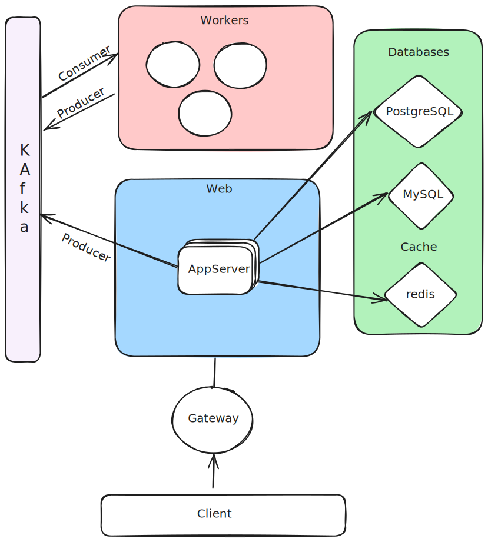

# Microservice DefaultApp (python)

Versatile start point for building a highly-available, scalable micro-service project in python.
```code
Tech Stack:
 * Python3 (Flask, SQLAlchemy)
 * Databases:
    - PostreSQL
    - MySQL
 * Events:
    - Kafka
 * Cache:
    - Redis

Integrations with:
- elasticsearch
- logstash
- kibana
- filebeat
- metricbeat
```

Warning
    **THIS PROJECT IS CURRENTLY IN ALPHA:**

    - This is a WIP and so some features might be broken.
    - Backwards compatibility isnt garantueed.


## Design



## More Info

[Developer Docs](docs/developer.md)
